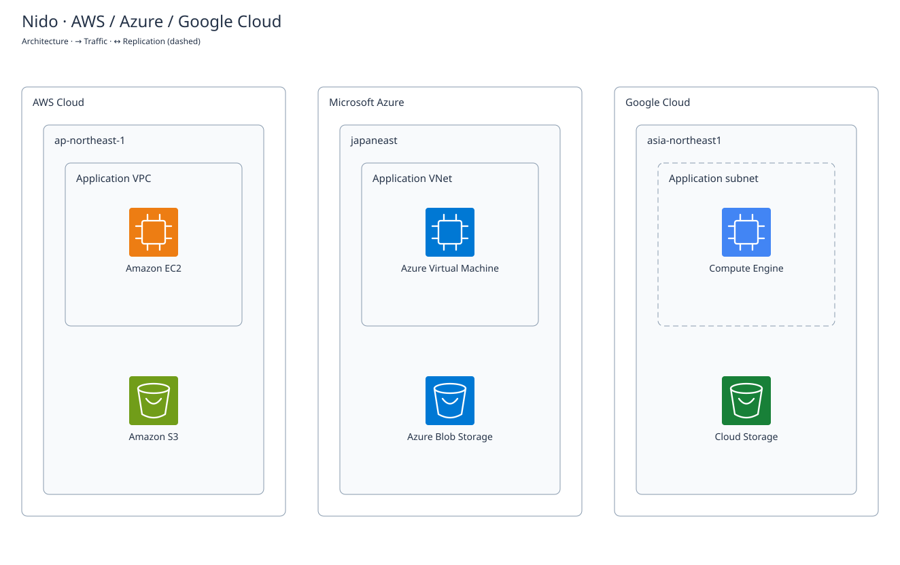
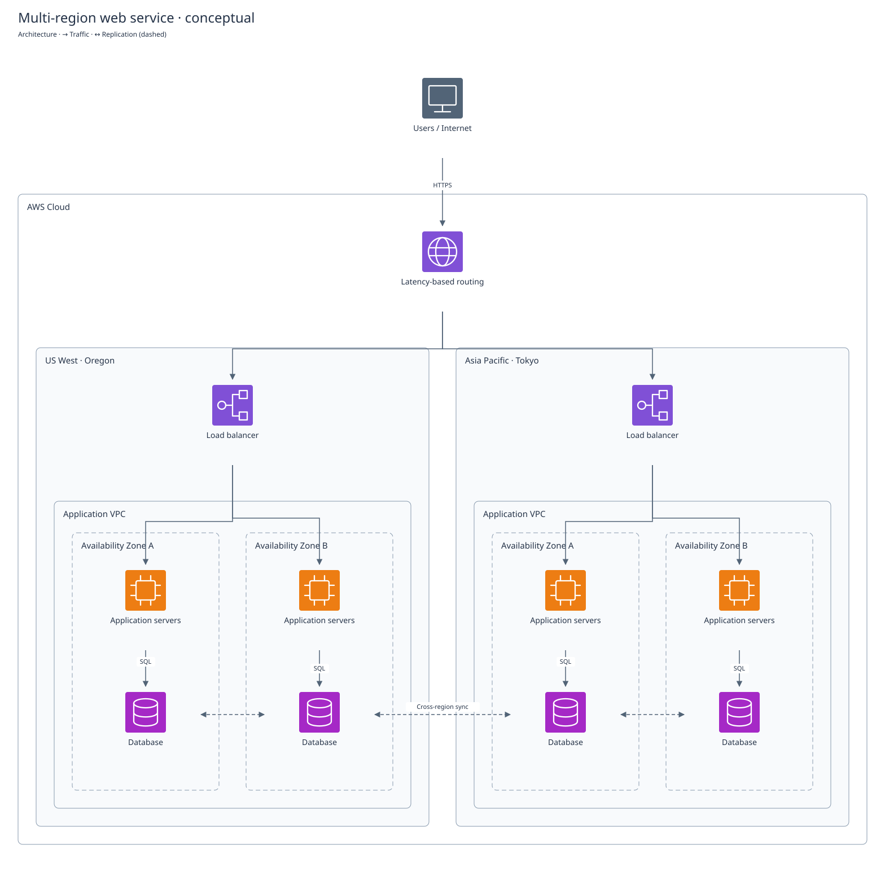

# Nido

Swiftでインフラを定義し、型の不整合をコンパイル時に検出するIaCツールです。
同じコードからTerraformの設定とインフラ構成図を生成します。AWS・Azure・Google Cloudの型付きAPIを同梱し、同じStackで利用できます。

```swift
let image = AMI("linux", provider: tokyo, architecture: ARM64.self,
                owners: .literal(["amazon"]), namePattern: "al2023-ami-2023.*-arm64")
let server = EC2Instance("app", image: image, instanceType: .t4gMicro,
                         subnet: subnet, securityGroups: [security])
```

この`image`に`InstanceType<X86_64>.t3Micro`を組み合わせると、Swiftのコンパイルが失敗します。
異なるリージョンや異なるVPCのリソースを混在させた場合も、型で区別している範囲で検出します。

**NidoはTerraform／OpenTofuを実行エンジンとして利用します。** Swiftの型付きフロントエンド、
スキーマからのSwiftコード生成、構成図生成をNidoが担当し、プロバイダーとの通信、plan、apply、
state、ロック、ドリフト検出は実行エンジンが担当します。独自にstateを複製しません。

## はじめる

必要なものはSwift 6.0以降、macOS 13以降またはLinux、Terraform 1.5以降です。
OpenTofuも`--engine tofu`で選択できます。`synth`と`diagram`には実行エンジンやクラウド認証情報は不要です。

```sh
git clone https://github.com/Moriya-Taichi/Nido.git
cd Nido
swift build -c release --product nido
mkdir -p "$HOME/.local/bin"
install -m 755 .build/release/nido "$HOME/.local/bin/nido"
export PATH="$HOME/.local/bin:$PATH"

# チェックアウトしたNidoを使う。公開mainを参照する場合は--local-packageを省略する。
nido new ../MyInfrastructure --local-package "$PWD"
cd ../MyInfrastructure
nido init
nido plan -out=review.tfplan
nido --skip-synth apply review.tfplan
nido output
nido diagram --format svg --output architecture.svg
nido destroy
```

生成されるサンプルは組み込みの`terraform_data`を使います。クラウド上のリソースは作成しません。
`apply review.tfplan`は保存済みプランを適用するTerraform標準の操作で、追加の確認は行いません。
プランを指定しない`apply`と`destroy`では、実行エンジンの確認プロンプトを維持します。

## Swiftで構成を定義する

インフラの定義は通常のSwiftPM実行可能ターゲットです。最後に`try stack.export()`を呼び出します。

```swift
import Nido

let message = Variable<String>("message", default: "Hello from Nido")
let greeting = TerraformData("greeting", input: message.value)
let consumer = TerraformData("consumer", input: greeting.output)

try Stack("Application") {
    message
    greeting
    consumer
    Output("message", value: consumer.output)
}.export()
```

`Value<T>`は、apply後に初めて確定する値の型を保持します。`Value<Bool>`を`Value<String>`の入力には渡せません。
通常の文字列リテラル中の`${...}`や`%{...}`はエスケープされ、意図せずTerraformの式として実行されません。
リソースのプロパティから取得した参照は、式と依存関係の両方を保持します。

`Stack`の中では`if`、`for`、Swiftの関数、`Components`を使って構成を再利用できます。
名前がTerraformのリソースアドレスになるため、ループでは安定した名前を付けてください。

## どの段階で検出するか

| 段階 | 検出する内容 |
|---|---|
| Swiftのコンパイル | 必須引数の省略、値の型、生成APIのcomputed属性への入力、構造化オブジェクトのフィールド、必須の非空コレクション |
| Swiftのコンパイル：`NidoAWS` | リソースの種類、リージョン、VPCのスコープ、AMIとインスタンスのCPUアーキテクチャ |
| Swiftのコンパイル：`NidoAzure` | サブスクリプション、リージョン、VNetスコープ、VMサイズとイメージのCPU、必須のSSH公開鍵 |
| Swiftのコンパイル：`NidoGoogleCloud` | プロジェクト、VPCスコープ、サブネットとゾーンのリージョン、VMとイメージのCPU |
| 構成生成前の検証 | 重複した宣言、未登録の参照先、循環参照、プロバイダーのバージョン競合、CIDRの範囲、ブロックの個数制約 |
| Terraformのvalidate／plan／apply | プロバイダー独自の制約、実在するリソース、権限、クォータ、在庫、他の構成との競合、実際のクラウド状態 |

**実現不可能な構成のすべてを、コンパイルだけで検出できるわけではありません。**
Swiftコードで表現した制約はコンパイラーで検証し、外部状態に依存する条件は実行エンジンで検証します。
生成APIの型情報はプロバイダースキーマの粒度に従います。たとえば、スキーマで単なる`string`となっているID同士の
違いや、スキーマに公開されない排他制約まで自動で推論することはできません。

## AWSの構成

SwiftPMのターゲットに`.product(name: "NidoAWS", package: "Nido")`を追加します。

```swift
import Nido
import NidoAWS

enum AppNetwork: NetworkScope {}
let tokyo = AWSProvider<APNortheast1>()
let vpc = VPC("app", cidr: try IPv4CIDR("10.0.0.0/16"), provider: tokyo, scope: AppNetwork.self)
let subnet = Subnet("app", vpc: vpc, cidr: try IPv4CIDR("10.0.1.0/24"))
let security = SecurityGroup("app", vpc: vpc, description: "Private application")
let image = AMI("linux", provider: tokyo, architecture: ARM64.self,
                owners: .literal(["amazon"]), namePattern: "al2023-ami-2023.*-arm64")
let server = EC2Instance("app", image: image, instanceType: .t4gMicro,
                         subnet: subnet, securityGroups: [security])

try Stack("Private application") {
    tokyo
    vpc
    subnet
    security
    image
    server
    Output("instance_id", value: server.id)
}.export()
```

VPCごとに異なる`NetworkScope`を宣言します。同じマーカーを誤って再利用した場合も、インスタンスに渡す
サブネットとセキュリティグループの実際のVPC参照を構成生成時に確認します。
AMIはアーキテクチャのEC2フィルターを付けて検索します。任意のAMI IDを型で正しいと見なす方式ではありません。

同梱しているAWS APIはVPC、Subnet、SecurityGroup、AMI、EC2Instance、S3Bucketです。
この例はプライベートネットワークです。インターネット経路やSSHアクセスは設定していません。
リージョンは`AWSRegion`を実装して追加できます。別アカウントを表す型は現時点では提供していません。

## マルチクラウド

必要なクラウドのSwiftPM productをインフラ定義ターゲットに追加します。
各モジュールは`Nido`のみに依存するため、AWSを使わないプロジェクトに`NidoAWS`は不要です。

| Product | 型付きAPI | プロバイダー制約（既定） |
|---|---|---|
| `NidoAWS` | VPC・Subnet・SecurityGroup・AMI・EC2・S3 | `hashicorp/aws ~> 6.0` |
| `NidoAzure` | ResourceGroup・VNet・Subnet・NSGとルール・NICとNSG関連付け・Linux VM・StorageAccount・BlobContainer | `hashicorp/azurerm ~> 4.0` |
| `NidoGoogleCloud` | VPC・Subnetwork・Ingress Firewall・Compute Engine・Storage Bucket | `hashicorp/google ~> 6.0` |

AzureのサブスクリプションとGoogle Cloudのプロジェクトには、別々のスコープ型を宣言します。
クラウド固有の引数と参照型を保つため、AzureのサブネットをCompute Engineに渡すことはできません。
CIDR、ポート範囲、ネットワークスコープ、CPU型は`Nido`で共有します。従来の`NidoAWS`名でも参照できます。

```swift
import Nido
import NidoAzure
import NidoGoogleCloud

enum Subscription: AzureSubscriptionScope {}
enum Project: GoogleProjectScope {}
let subscription = Variable<String>("azure_subscription_id")
let project = Variable<String>("google_project_id")
let azureName = Variable<String>("azure_storage_name")
let googleName = Variable<String>("google_bucket_name")
let azure = AzureProvider(subscriptionID: subscription.value, scope: Subscription.self)
let google = GoogleProvider(project: project.value, scope: Project.self)
let group = AzureResourceGroup("app", resourceGroupName: "nido-app", region: JapanEast.self, provider: azure)
let blob = AzureStorageAccount("objects", accountName: azureName.value, group: group)
let bucket = GoogleStorageBucket("objects", bucketName: googleName.value, region: AsiaNortheast1.self, provider: google)

try Stack("Azure and Google Cloud") {
    subscription; project; azureName; googleName
    azure; google; group; blob; bucket
}.export()
```

AzureのNICは同じサブスクリプション・リージョン・VNetのSubnetとNSGを要求し、NSGの関連付けと
ルールを含めてVMの作成依存関係を生成します。VMはSSH公開鍵認証を使います。
Google CloudのVPCはグローバルなので、同一の`GoogleNetwork`に異なるリージョンの
`GoogleSubnetwork`を追加できます。VMのゾーン型はSubnetのリージョン型と一致する必要があります。
指定したFirewallのターゲットタグとVMのタグは同じ値で生成します。

3クラウドのVM・ネットワーク・ストレージを含む完全な例は
[Examples/MultiCloud/main.swift](Examples/MultiCloud/main.swift)です。

```sh
# リポジトリ直下で、認証なしに構成と図を生成
swift run nido-multicloud-example --nido-output .nido-multicloud
swift run nido diagram --from .nido-multicloud/nido.graph.json --format svg --output multicloud.svg

# エンジンがプロバイダーを取得し、構成を検証
swift run nido --product nido-multicloud-example --directory .nido-multicloud init
swift run nido --product nido-multicloud-example --directory .nido-multicloud validate
```

plan/applyには各クラウドの認証と、`azure_subscription_id`、`google_project_id`、
`azure_ssh_public_key`、`azure_storage_name`、`google_bucket_name`、`aws_bucket_name`の変数を設定します。
AzureはプロバイダーのAzure CLI・環境変数・OIDC認証、Google CloudはADC等の標準認証を使います。
別のアカウントやプロジェクトには別スコープとprovider aliasを使ってください。
このサンプルのVMはプライベートIPを使用し、クラウド間のVPNや通信経路は作成しません。



既定の構成図でも3クラウドを自動分類します。`Architecture`で`cloud: .azure`などを指定すると、
概念図のサービスもクラウド別の配色になります。図形はNido独自のもので、公式ロゴではありません。
専用APIがないサービスは、各プロバイダースキーマからSwift APIを生成して追加できます。

## コードから構成図を出力する

```sh
nido diagram --format mermaid --output architecture.mmd
nido diagram --format dot --output architecture.dot
nido diagram --format svg --output architecture.svg

# 既に生成したグラフを使う場合
nido diagram --from .nido/nido.graph.json --format svg --output architecture.svg
```

SVGはサービスアイコンとクラウド・リージョン・VPC・AZなどの境界を持つ構成図です。
Graphvizやブラウザーは不要で、アイコンを含むSVG単体で表示できます。
アイコンはNido独自の図形です（AWS公式アイコンではありません）。

`Stack`の`architecture:`に表示内容を指定します。`resource:`には実際のリソースの
`dependency.address`を渡せます。存在しない参照や、境界の循環・重複を生成時に検証します。

```swift
let architecture = Architecture(
    groups: [
        .init("cloud", label: "AWS Cloud", kind: .cloud),
        .init("vpc", label: "Application VPC", kind: .vpc, parent: "cloud"),
        .init("subnet", label: "Private subnet", kind: .subnet, parent: "vpc"),
    ],
    services: [
        .init("app", label: "Amazon EC2", icon: .compute, parent: "subnet",
              resource: server.dependency.address, detail: "Application"),
    ]
)
// Stack("Application", architecture: architecture) { ... }
```

`DiagramConnection("client", "app", label: "HTTPS")`で通信、
`DiagramConnection("primary", "replica", kind: .replication)`で破線・双方向の同期を指定します。
接続先は`services`のIDです。通信の循環は許可され、Terraformの作成依存関係の循環は従来どおり拒否されます。
同じ親の要素は`row`の昇順に配置され、同じ行ではID順に横に並びます。
MermaidとDOTでも境界と接続を出力しますが、内蔵アイコンと行指定のレイアウトはSVG用です。



この図は[Swiftサンプル](Examples/Architecture/main.swift)から生成した設計例です。
AWSリソースの作成は行わない概念図で、実リソースを定義する場合は`resource:`で対応付けます。

```sh
swift run nido-architecture-example --nido-output .nido-architecture
swift run nido diagram --from .nido-architecture/nido.graph.json --format svg --output architecture.svg
```

[AWSサンプル](Examples/AWS/main.swift)は実際に宣言したEC2、VPC、Subnetを図示します。
`architecture:`を省略するとリソースとモジュールの一覧をアイコン付きで表示し、AWS・Azure・Google Cloudのリソースを
それぞれのクラウドで囲みます。リージョンや通信経路は自動推測しません。

従来の作成依存関係図も利用できます。

```sh
nido diagram --view dependencies --format svg --output dependencies.svg
```

図は宣言した内容を表し、実際の疎通、外部モジュール内部、`count`／`for_each`の実行時の
個別インスタンスは表しません。設定値は自動転記しませんが、図のラベルや注釈は公開されるため秘密値を入れないでください。
大規模な図では`row`で配置を調整するか、DOTをGraphvizで配置してください。

## プロバイダースキーマからSwiftの型を生成する

初期化済みのTerraformディレクトリで、使用するプロバイダーのスキーマを取得します。

```sh
terraform providers schema -json > provider-schema.json
nido provider generate \
  --schema provider-schema.json \
  --provider registry.terraform.io/hashicorp/aws \
  --prefix GeneratedAWS \
  --provider-version '~> 6.0' \
  --type aws_vpc --type aws_subnet --type aws_instance \
  --output Sources/Infrastructure/GeneratedAWS.swift
```

生成対象はprovider、resource、data sourceの設定と属性です。プリミティブ、list、set、map、object、tuple、
ネストしたブロックに対応します。必須引数は初期化時に必要となり、computed専用属性は読み取り用プロパティになります。
`number`は`Double`、setはSwiftの配列、dynamicは`JSONValue`として表現します。
`--type`は複数回指定でき、省略すると全リソースとdata sourceを対象にします。大規模なプロバイダーでは必要な型に絞ると
Swiftのビルド時間を抑えられます。組み込みのTerraformプロバイダーは生成対象外で、`TerraformData`を直接使用します。

list／setブロックが必須なら`NonEmpty`、最大1件なら単一のSwift値を使います。
2件以上の最小値や上限は構成生成時に検証します。ネストしたオブジェクトは生成された型の`.value`で渡せます。
生成コード、取得元のスキーマ、`.terraform.lock.hcl`を併せて管理し、プロバイダー更新時には型も再生成してください。

`NidoAWS`の意味的な型制約は手書きAPIで提供します。スキーマから生成したAPIは、公開スキーマの構造上の制約を検証します。
provider functions、ephemeral resourcesの専用Swift API生成には未対応です。

## Terraformの機能と対応関係

| 機能 | Nidoでの利用方法 |
|---|---|
| init／validate／plan／apply／destroy | 同名のCLIコマンド。実行前にSwiftをコンパイルして構成を生成 |
| 保存済みプラン | `nido plan -out=review.tfplan` → `nido --skip-synth apply review.tfplan` |
| state、ロック、ドリフト、失敗後の再実行 | Terraform／OpenTofuの標準動作を利用 |
| リモートstate | `Stack(backend: Backend(...))`。バックエンドの設定はリテラルJSON |
| 変数、outputs、locals | `Variable<T>`、`Output<T>`、`Local<T>` |
| data sources | 同梱API、またはスキーマから生成した型 |
| モジュール | Swiftの関数／`Components`、既存モジュールには`TerraformModule` |
| 依存関係 | 型付きの値の参照から推論。補助的な関係は`ResourceOptions(dependsOn:)` |
| lifecycle | `Lifecycle`の`createBeforeDestroy`、`preventDestroy`、`ignoreChanges` |
| count／for_each | 基礎APIの`Resource.counted`／`forEach`。値の取得には添字が必要 |
| import／moved | `Import`／`Move`、または`nido import` |
| workspace、state操作 | `nido workspace ...`、`nido state ...` |
| その他のエンジン機能 | `nido exec <command> ...`。追加の`.tf`／`.tf.json`も同じ作業ディレクトリで使用可能 |

エンジン固有のフラグはそのまま渡します。`plan -detailed-exitcode`の終了コード2も維持します。
フラグやモジュールsourceに含まれる相対パスは、**Terraformの作業ディレクトリ（標準は`.nido`）基準**です。
たとえばプロジェクト直下の変数ファイルは`nido plan -var-file=../production.tfvars`と指定します。
`nido exec`は構成を再生成しません。必要に応じて先に`nido synth`を実行してください。

プロジェクトの切り替えなど、Nido自身のオプションはコマンドより前に置きます。

```sh
nido --package ./infrastructure --product Production --engine tofu plan
```

`NIDO_TERRAFORM`で実行エンジン、`NIDO_SWIFT_JOBS`でSwiftビルドの並列数を指定することもできます。

## 状態と秘密情報

Nidoが更新するのは`main.tf.json`と`nido.graph.json`です。構成生成のたびにstate、プロバイダーの
ロックファイル、他の`.tf`ファイルを削除することはありません。コンパイルに失敗した場合や`export()`を
呼び忘れた場合は、エンジンを起動せずに終了します。

`Variable<String>("password", sensitive: true)`の値を参照すると、対応する出力にもsensitive指定を引き継ぎます。
`sensitive`は暗号化ではありません。秘密情報をSwiftのリテラルや変数のデフォルトに書くと、生成設定にも保存されます。
認証情報には実行環境、プロファイル、`TF_VAR_...`などを使用し、stateと保存済みプランは適切に保護してください。
生成ファイルの権限は`0600`です。`.terraform.lock.hcl`はバージョン管理し、stateやプランは除外します。

`Resource`、`Block`、`AnyValue`はプロバイダー実装用の基礎APIです。
`unsafeExpression`、`unsafeAttribute`、`unsafeOutput`、各VMサイズ・イメージの`unchecked`は型情報を自分で保証する
明示的な拡張用APIです。手書きの式では依存関係も明示してください。これらを利用した部分は、型安全性の保証範囲から外れます。

## 開発と検証

```sh
swift test --jobs 1
python3 Scripts/test_compile_failures.py
python3 Scripts/test_multicloud_compile.py
python3 Scripts/test_diagrams.py
python3 Scripts/test_schema.py
python3 Scripts/test_e2e.py
NIDO_TEST_ENGINE=tofu python3 Scripts/test_e2e.py
python3 Scripts/test_multicloud_providers.py
NIDO_TEST_ENGINE=tofu python3 Scripts/test_multicloud_providers.py
```

コンパイル失敗テストでは正常な構成がコンパイルできることを先に確認し、不正な型の組み合わせだけを変更して失敗を検証します。
E2Eテストでは一時ディレクトリの組み込みリソースだけを使い、クラウド上にはリソースを作成しません。
互換性テストではAWS 6.0.0・AzureRM 4.0.0・Google 6.0.0の実プロバイダーを取得し、
同一Stackのvalidate、実スキーマからのSwiftコード生成とコンパイルを行います。
実際のクラウドへのデプロイは、このテスト範囲には含まれません。

設計と対応範囲は[Docs/design.md](Docs/design.md)を参照してください。
